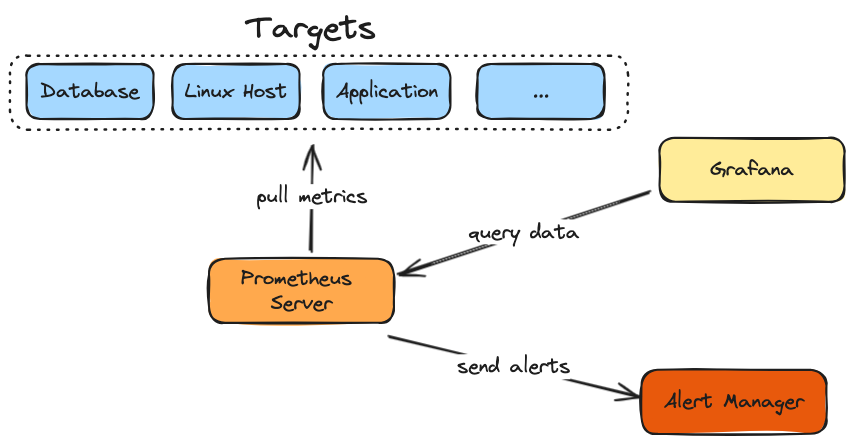
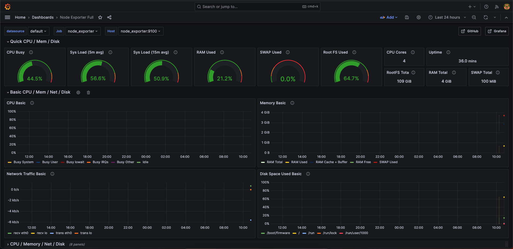

# Monitoring

The goal of a centralised monitoring system is to quickly identify the health of all the servers and get notified when thresholds are reached and to track any errors. Everything is accessible with a single dashboard.
Two different monitoring teqniques: logs and metrics.
- **logs**:  typically stored in the */var/log* directory and stores the logs of the app in the system. 
- **metrics**: are more about statistics like CPU/disk utilizations

*Prometheus* is an open source monitoring systems.

## Monitoring architecture
- **Prometheus server**: pulls the metrics from different targets. You have to define all the systems and services you want to collect metrics from inside the prometheus config file: then prometheus will initialise the connection with these targets and scrape the metrics in a specific interval
- **Targets**: both physical machine (like Linux server, K8s cluster) and applications (docker container) 
- **Grafana**: service that queries the metrics (in PromQL language) from a prometheus server and offer the ability to visualise them via a web UI (dashboard)

## Dashboard example

